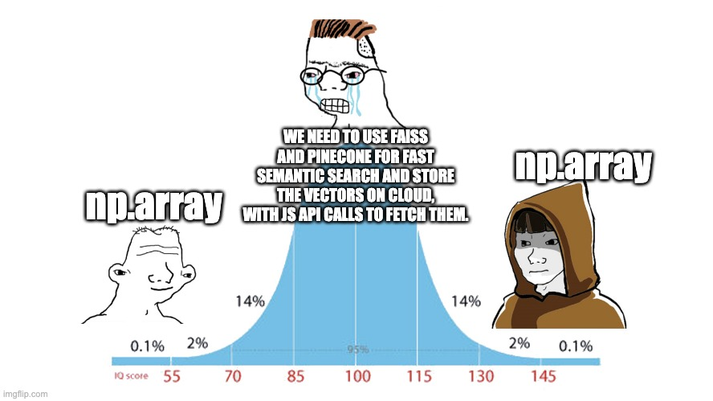

# smolvecstore

a tiny vectorstore implementation built with numpy.
that's it.

numpy is all you need?




### motivation

tired of hearing about all the available vectorstore libraries along with buzzwords thrown around, here is a tiny implementation of a "Vectorstore" built with `numpy` and `sentence-transformers` in python.

this implementation is only ~100 lines of python code but still works fast enough (on cpu).

lol, lmao even.


### example

this is how the code to use this Vectostore will look like.

**code**:

```python
docs = [
    "Super mario is a nice video game.", 
    "The USA election are on the way!",
    "A video game is fun to play with friends.",
    "What if the earth was covered with plasma instead of water?"
]

vs = Vectorstore.from_docs(docs, embedder=model)

query = "which is a nice game you can think of?"
similar_docs, scores = vs.search(query, k=2)
```

**output**:

```
Most similar documents: ['A video game is fun to play with friends.', 'Super mario is a nice video game.']

Scores w.r.t query (lower is better): [14.200933, 15.170744]
```